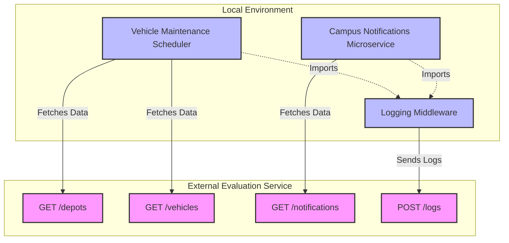
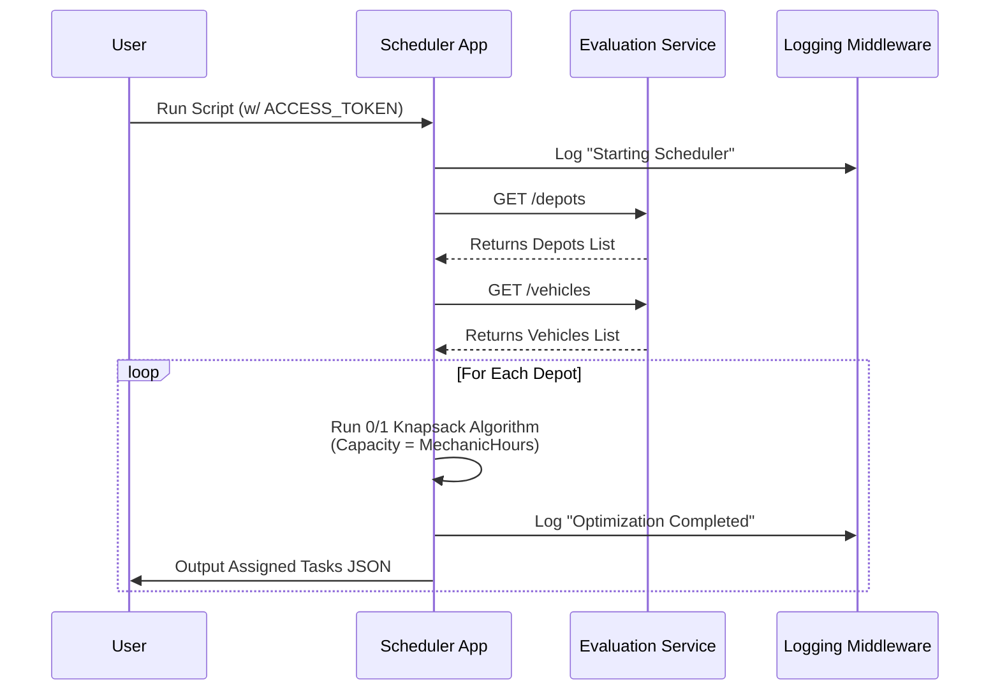

# Backend Engineering Evaluation Project

This repository contains the complete implementation for the backend engineering evaluation. It is composed of three primary sub-projects designed to demonstrate modularity, algorithm optimization, and microservice system design.

## 🏗️ System Architecture

The project consists of three loosely coupled modules that all interact with the external Evaluation Service.



---

## 📂 Project Structure

1. **`logging_middleware/`**: A reusable, centralized npm package for mapping application logs to a remote logging API.
2. **`vehicle_maintence_scheduler/`**: A task-scheduling script using the 0/1 Knapsack dynamic programming algorithm to optimally allocate vehicle tasks to maintenance depots.
3. **`notification_system_design.md`**: A comprehensive system design document covering REST API design, PostgreSQL database architecture, caching strategies, and bulk notification queueing architectures.
4. **`notification_app_be/`**: A microservice feature implementing a "Priority Inbox" using in-memory sorting logic to compute composite scores based on weight and recency.

---

## ⚙️ Prerequisites

- **Node.js** (v18 or higher recommended)
- **TypeScript** (Installed locally via dependencies)
- **Access Token:** An active Bearer token is required to authenticate with the remote APIs.

---

## 🛠️ Component Details & Usage

### 1. Logging Middleware (`logging_middleware/`)
A custom logger built to enforce uniform logging across all applications without relying on built-in console utilities. It pushes log events directly to the external logging service.

**Installation:**
This package is linked locally to the other sub-projects. No independent execution is required, but it must be compiled first.
```bash
cd logging_middleware
npm install
npx tsc
```

### 2. Vehicle Maintenance Scheduler (`vehicle_maintence_scheduler/`)

This module fetches active depots and vehicles via API, then applies the **0/1 Knapsack Algorithm**. 
- **Capacity:** Depot Mechanic Hours
- **Weight:** Vehicle Task Duration
- **Value:** Vehicle Task Impact

The algorithm independently computes the optimal combination of vehicles to maximize impact within the given hour limits for each depot.

#### Execution Flow


**Execution:**
Ensure you have set your `ACCESS_TOKEN` environment variable before running.
```bash
cd vehicle_maintence_scheduler
npm install
npx tsc
export ACCESS_TOKEN="your_token_here"
node dist/index.js
```
*Output: JSON arrays containing the assigned tasks, total duration, and max impact per depot.*

### 3. Campus Notifications Priority Inbox (`notification_app_be/`)

This module fetches real-time notifications for a student and calculates a composite priority score using the formula:
`Score = (Weight * 10,000,000,000,000) + Unix Timestamp`
- **Weights:** Placement = 3, Result = 2, Event = 1.

This ensures Placement notifications always supersede Results, but recency is maintained within the same category. It extracts and displays the top 10 most critical unread notifications.

#### Priority Sorting Logic
```mermaid
flowchart TD
    A[Fetch Notifications from API] --> B[Map over Notifications]
    B --> C{Determine Type Weight}
    C -->|Placement| W3[Weight = 3]
    C -->|Result| W2[Weight = 2]
    C -->|Event| W1[Weight = 1]
    
    W3 --> D[Calculate Score:<br/>(Weight * 10^13) + Timestamp]
    W2 --> D
    W1 --> D
    
    D --> E[Sort Array Descending by Score]
    E --> F[Slice Top 10]
    F --> G[Output Priority Inbox JSON]
```

**Execution:**
Ensure you have set your `ACCESS_TOKEN` environment variable before running.
```bash
cd notification_app_be
npm install
npx tsc
export ACCESS_TOKEN="your_token_here"
node dist/index.js
```
*Output: JSON array of the top 10 notifications sorted descending by their computed score.*

---

## 🔒 Architectural & Coding Constraints Followed
- **No Comments:** Code has been written to be intrinsically readable with human-style variable naming. No comments exist in the TS files.
- **Strict Logging:** `console.log` has been entirely avoided in favor of the custom `logging_middleware`.
- **Modular TypeScript:** Strong typings and isolated scopes across the three sub-projects.
